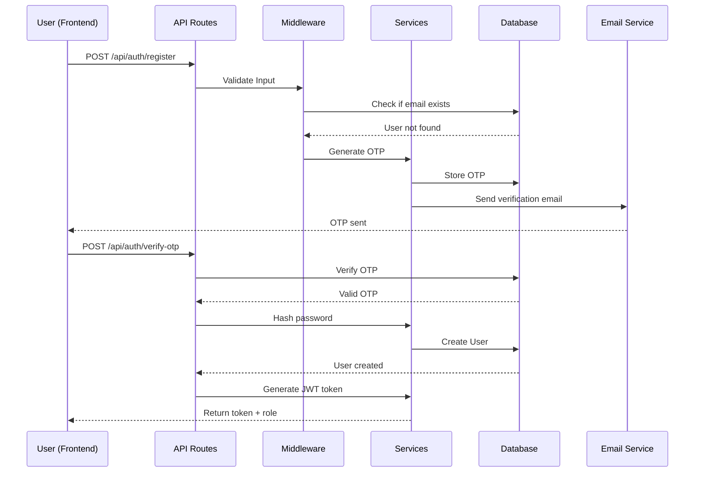
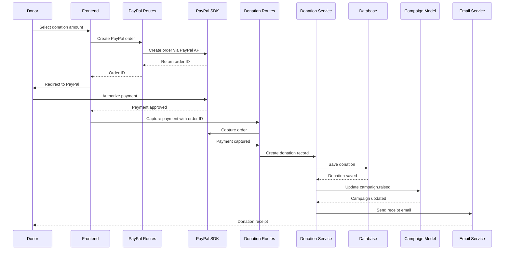
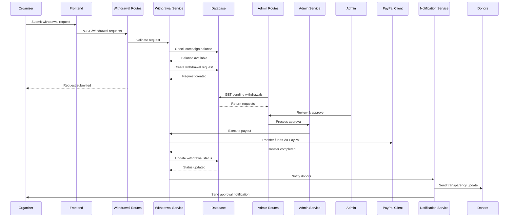
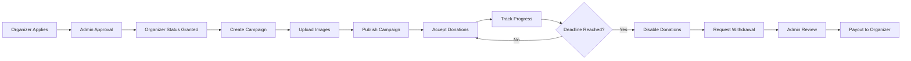
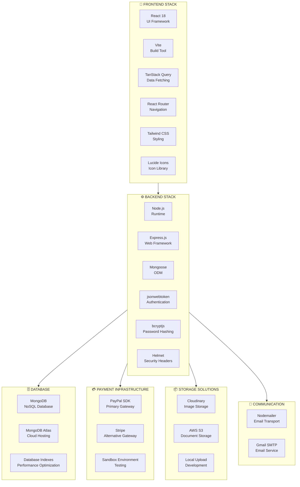
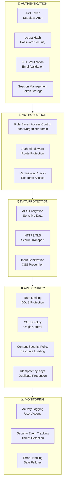
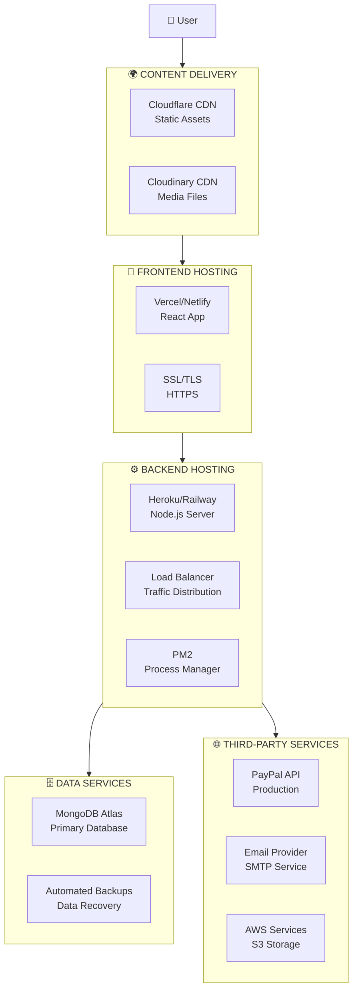

# Fundraising Platform - Complete System Architecture

## High-Level Architecture Overview

```mermaid
flowchart TB
    subgraph ClientLayer["🖥️ PRESENTATION LAYER - React Frontend"]
        DonorPortal["👤 Donor Portal<br/>Browse, Donate, Track"]
        OrganizerPortal["🎯 Organizer Portal<br/>Create, Manage, Withdraw"]
        AdminDashboard["🛡️ Admin Dashboard<br/>Monitor, Approve, Govern"]
    end

    subgraph SecurityLayer["🔐 SECURITY & API GATEWAY LAYER - Express.js"]
        CORS["🔒 CORS Policy"]
        Helmet["🛡️ Helmet Security"]
        RateLimit["⚡ Rate Limiting"]
        JWT["🔑 JWT Auth"]
        RBAC["👮 Role-Based Access Control"]
        Validation["✅ Input Validation"]
    end

    subgraph ApplicationLayer["📡 APPLICATION LAYER - API Routes"]
        AuthRoutes["🔑 Auth Routes<br/>/api/auth/*"]
        CampaignRoutes["🎯 Campaign Routes<br/>/api/campaigns/*"]
        DonationRoutes["💰 Donation Routes<br/>/api/donations/*"]
        PayPalRoutes["💳 PayPal Routes<br/>/api/paypal/*"]
        OrganizerRoutes["📋 Organizer Routes<br/>/api/organizer/*"]
        WithdrawalRoutes["💸 Withdrawal Routes<br/>/api/withdrawals/*"]
        AdminRoutes["👑 Admin Routes<br/>/api/admin/*"]
        NotificationRoutes["🔔 Notification Routes<br/>/api/notifications/*"]
    end

    subgraph ServiceLayer["⚙️ SERVICE LAYER - Business Logic"]
        EmailService["📧 Email Service<br/>Notifications, Receipts"]
        NotificationService["🔔 Notification Service<br/>In-App Events"]
        AdminService["👑 Admin Service<br/>User & Campaign Mgmt"]
        WithdrawalService["💸 Withdrawal Service<br/>Payout Processing"]
        PayPalClient["🏦 PayPal Client<br/>Payment Gateway"]
        CampaignJob["📊 Campaign Job<br/>Expiration Automation"]
        UploadService["📁 Upload Service<br/>File Management"]
        ActivityLogger["📝 Activity Logger<br/>Audit Trail"]
    end

    subgraph DataLayer["🗄️ DATA ACCESS LAYER - MongoDB + Mongoose"]
        UserModel["👤 User<br/>email, role, passwordHash"]
        CampaignModel["🎯 Campaign<br/>title, target, raised"]
        DonationModel["💰 Donation<br/>amount, donor, status"]
        OrganizerAppModel["📋 OrganizerApplication<br/>orgName, documents"]
        WithdrawalModel["💸 WithdrawalRequest<br/>amount, campaign"]
        NotificationModel["🔔 Notification<br/>recipient, eventType"]
        OrganizerProfileModel["📊 OrganizerProfile<br/>bio, socialLinks"]
        OTPModel["🔐 OTP<br/>email, otp, expiresAt"]
        ActivityLogModel["📝 ActivityLog<br/>user, activityType"]
        IdempotencyModel["🔑 IdempotencyKey<br/>key, response"]
    end

    subgraph ExternalLayer["🌐 EXTERNAL SERVICES"]
        PayPalSDK["💳 PayPal SDK<br/>Payment Processing"]
        Cloudinary["☁️ Cloudinary<br/>Image Hosting"]
        AWSS3["📦 AWS S3<br/>Document Storage"]
        Nodemailer["📧 Nodemailer<br/>Email Delivery"]
        MongoDBAtlas["🗄️ MongoDB Atlas<br/>Database"]
    end

    %% Connections
    ClientLayer --> SecurityLayer
    SecurityLayer --> ApplicationLayer
    ApplicationLayer --> ServiceLayer
    ServiceLayer --> DataLayer
    ServiceLayer --> ExternalLayer

    style ClientLayer fill:#667eea,stroke:#333,color:white
    style SecurityLayer fill:#f093fb,stroke:#333,color:white
    style ApplicationLayer fill:#4facfe,stroke:#333,color:white
    style ServiceLayer fill:#43e97b,stroke:#333,color:white
    style DataLayer fill:#fa709a,stroke:#333,color:white
    style ExternalLayer fill:#a8edea,stroke:#333,color:white
```



## Core Data Flows

### 1. User Registration & Authentication Flow



### 2. Donation Processing Flow



### 3. Withdrawal Request & Approval Flow



### 4. Campaign Creation & Management Flow



## Technology Stack Architecture



## Security Architecture



## Database Schema Relationships

```mermaid
erDiagram
    USER ||--o{ CAMPAIGN : creates
    USER ||--o{ DONATION : makes
    USER ||--o{ WITHDRAWAL_REQUEST : submits
    USER ||--o{ NOTIFICATION : receives
    USER ||--o{ ORGANIZER_APPLICATION : applies
    USER ||--o| ORGANIZER_PROFILE : has
    
    CAMPAIGN ||--o{ DONATION : receives
    CAMPAIGN ||--o{ WITHDRAWAL_REQUEST : generates
    
    DONATION }o--|| USER : made_by
    DONATION }o--|| CAMPAIGN : supports
    
    WITHDRAWAL_REQUEST }o--|| CAMPAIGN : for_campaign
    WITHDRAWAL_REQUEST }o--|| USER : requested_by
    
    ORGANIZER_APPLICATION }o--|| USER : applicant
    ORGANIZER_PROFILE }o--|| USER : profile_of
    
    ACTIVITY_LOG }o--|| USER : performed_by
    
    USER {
        string email PK
        string passwordHash
        string role "donor|organizer|admin"
        boolean isOrganizerApproved
        string name
        string resetToken
        datetime resetTokenExpiry
        timestamps
    }
    
    CAMPAIGN {
        string title
        string description
        string imageURL
        number target
        number raised
        string status "active|expired|inactive"
        datetime deadlineAt
        ObjectId owner FK
        timestamps
    }
    
    DONATION {
        ObjectId campaign FK
        ObjectId donor FK
        string donorEmail
        boolean isAnonymous
        number amount
        string method "paypal"
        string paypalOrderId
        string transactionId
        string status "COMPLETED|PENDING|FAILED"
        timestamps
    }
    
    WITHDRAWAL_REQUEST {
        ObjectId campaign FK
        ObjectId organizer FK
        number amount
        string status "pending|approved|rejected|completed"
        array documents
        string transactionReference
        string reviewNotes
        timestamps
    }
    
    ORGANIZER_APPLICATION {
        ObjectId user FK
        string organizationName
        string organizationType
        string registrationNumber
        array documents
        string status "pending|approved|rejected"
        datetime reviewedAt
        timestamps
    }
    
    NOTIFICATION {
        ObjectId recipient FK
        string eventType
        string title
        string message
        json payload
        boolean isRead
        timestamps
    }
```

## Deployment Architecture



## Key Features by Layer

### Presentation Layer Features
- **Multi-Role Dashboards**: Custom UIs for Donors, Organizers, and Admins
- **Responsive Design**: Mobile-first approach with Tailwind CSS
- **Real-time Updates**: React Query for data synchronization
- **Role Switching**: Seamless context switching between roles
- **Notification Center**: In-app notification management

### Application Layer Features
- **RESTful API**: Standardized HTTP methods and status codes
- **Version Control**: API versioning support
- **Pagination**: Efficient data loading with cursor-based pagination
- **Filtering & Sorting**: Advanced query capabilities
- **Error Handling**: Consistent error response format

### Service Layer Features
- **Email Automation**: Transactional emails for all critical actions
- **Scheduled Jobs**: Campaign expiration automation
- **Payment Orchestration**: Multi-step payment workflows
- **Transparency Engine**: Donor visibility into fund usage
- **Audit Trail**: Comprehensive activity logging

### Data Layer Features
- **Schema Validation**: Mongoose schema enforcement
- **Indexing Strategy**: Performance-optimized queries
- **Data Integrity**: Referential integrity with MongoDB refs
- **Soft Deletes**: Archive instead of hard delete
- **Timestamps**: Automatic createdAt/updatedAt tracking

## Scalability Considerations

1. **Horizontal Scaling**: Stateless API servers behind load balancer
2. **Database Scaling**: MongoDB replica sets with read replicas
3. **Caching Strategy**: Redis for session and query caching
4. **CDN Integration**: Static assets served from edge locations
5. **Microservices Ready**: Modular architecture for future service extraction
6. **Queue System**: Message queues for async processing (future enhancement)
7. **API Rate Limiting**: Per-user and per-IP rate limiting
8. **Database Sharding**: Potential for horizontal data partitioning

---

**Architecture Documentation Version**: 1.0  
**Last Updated**: 2026  
**Technology Stack**: MERN (MongoDB, Express.js, React, Node.js) + PayPal Integration
