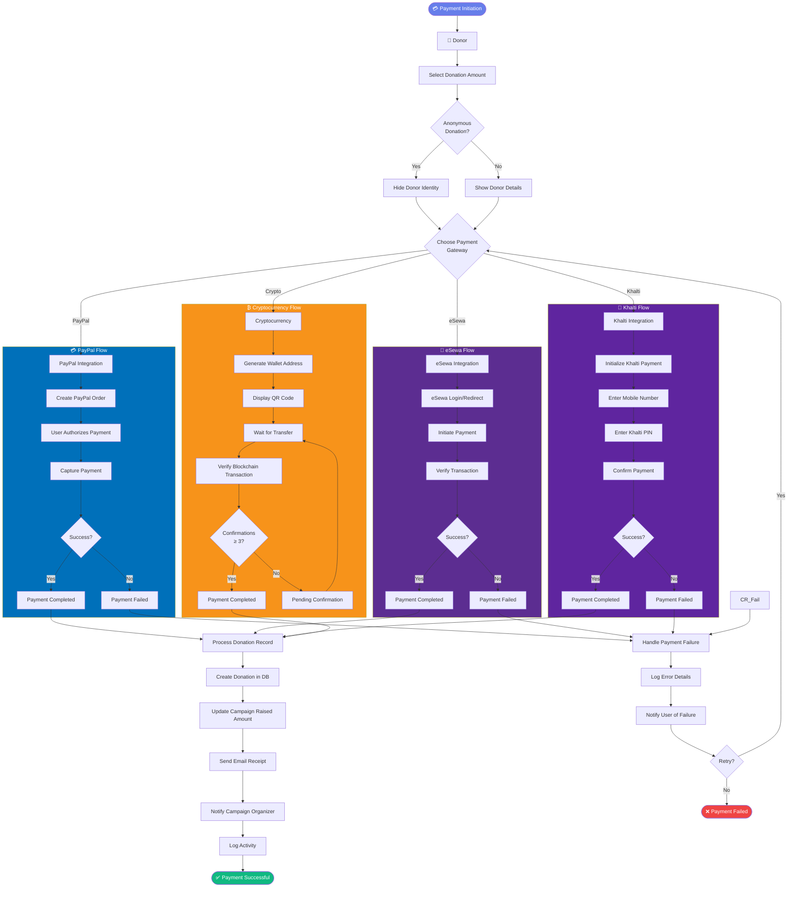
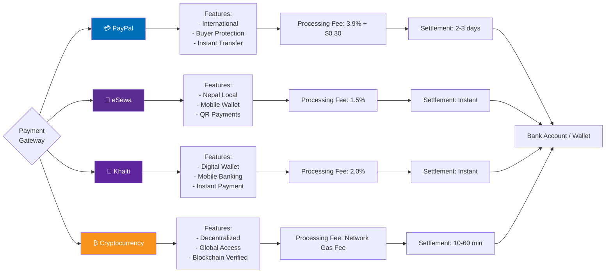
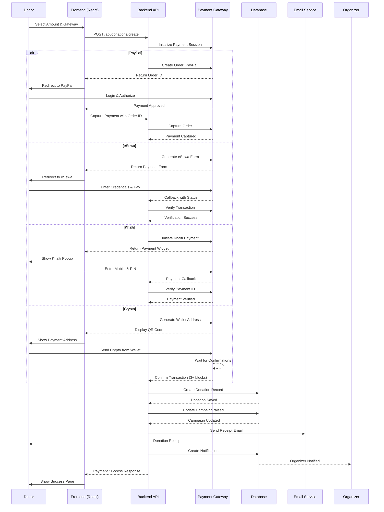
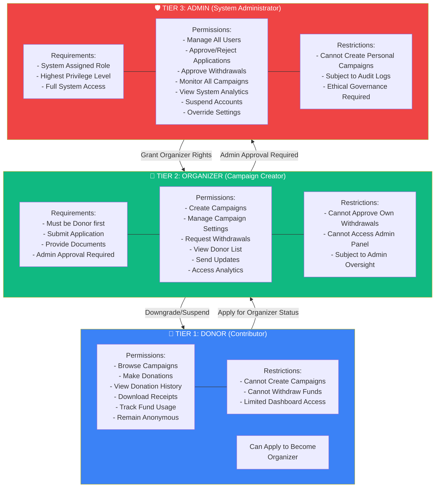
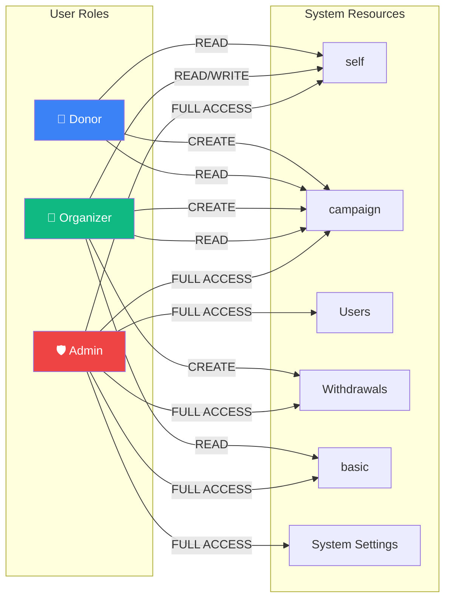
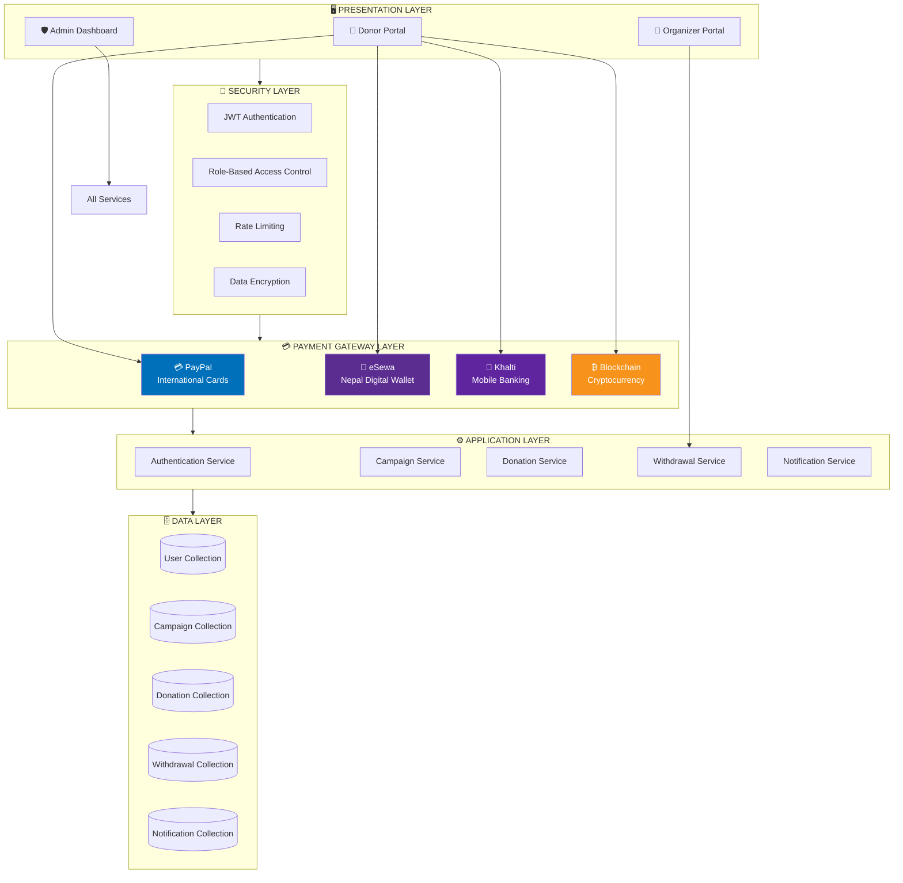
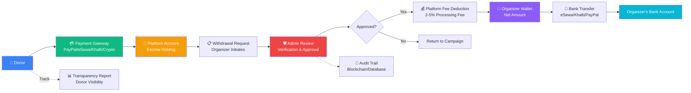
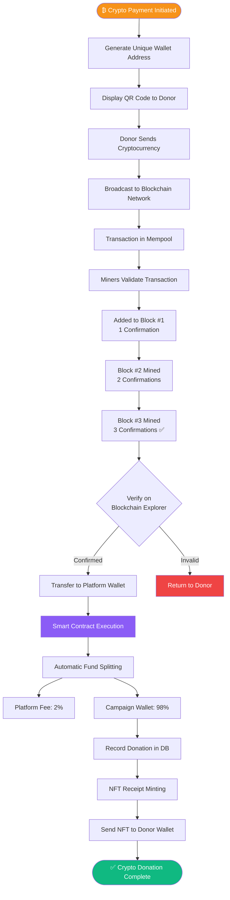

# Fundraising Platform - Payment Flow & User Roles Architecture

## 1. Complete Payment Processing Flow Diagram



## 2. Multi-Payment Gateway Comparison Flow



## 3. Detailed Payment Sequence Diagram



## 4. 3-Tier User Role Architecture



## 5. Role-Based Access Control (RBAC) Matrix



## 6. User Role Transition State Machine

```mermaid
stateDiagram-v2
    [*] --> Visitor: Browse Site
    
    Visitor --> RegisteredDonor: Register Account
    RegisteredDonor --> ActiveDonor: Make First Donation
    ActiveDonor --> RepeatDonor: Multiple Donations
    
    RegisteredDonor --> Applicant: Apply for Organizer
    Applicant --> PendingApproval: Application Submitted
    PendingApproval --> Rejected: Admin Rejects
    PendingApproval --> ApprovedOrganizer: Admin Approves
    Rejected --> Applicant: Reapply
    
    ApprovedOrganizer --> CampaignCreator: Create Campaign
    CampaignCreator --> Fundraiser: Receive Donations
    Fundraiser --> WithdrawalRequester: Request Payout
    
    ApprovedOrganizer --> Suspended: Violation Detected
    Suspended --> [*]: Account Terminated
    
    ActiveDonor --> VIPDonor: Large/Repeat Donations
    VIPDonor --> AnonymousDonor: Choose Anonymity
    
    note right of RegisteredDonor
        Tier 1: Donor
        - Browse campaigns
        - Make donations
        - View history
    end note
    
    note right of ApprovedOrganizer
        Tier 2: Organizer
        - Create campaigns
        - Manage funds
        - Request withdrawals
    end note
    
    note right of Admin
        Tier 3: Admin
        - Full system control
        - Approve requests
        - Monitor all activity
    end note
    
    state Admin <<choice>>
    RegisteredDonor --> Admin: Special Assignment
```

## 7. Complete System Architecture with Payment Gateways



## 8. Fund Flow from Donor to Organizer



## 9. Blockchain Crypto Payment Verification Flow



---

**Diagram Version**: 1.0  
**Created**: 2026  
**Payment Gateways**: PayPal, eSewa, Khalti, Cryptocurrency  
**Architecture Type**: 3-Tier Role-Based Access Control
