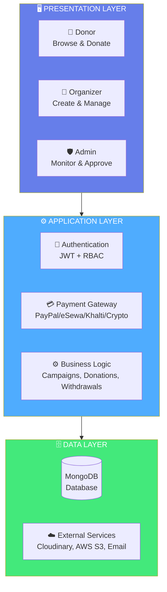
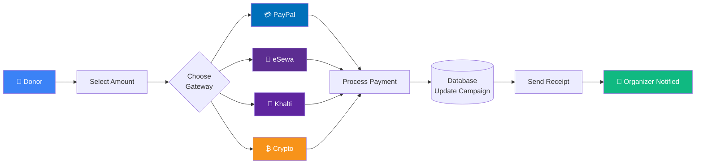
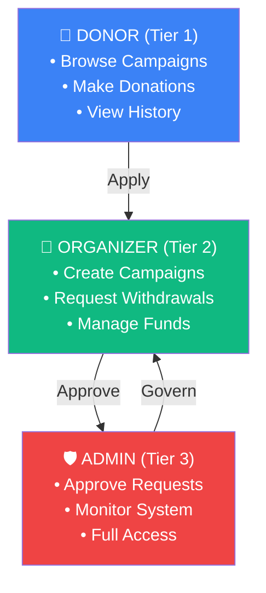
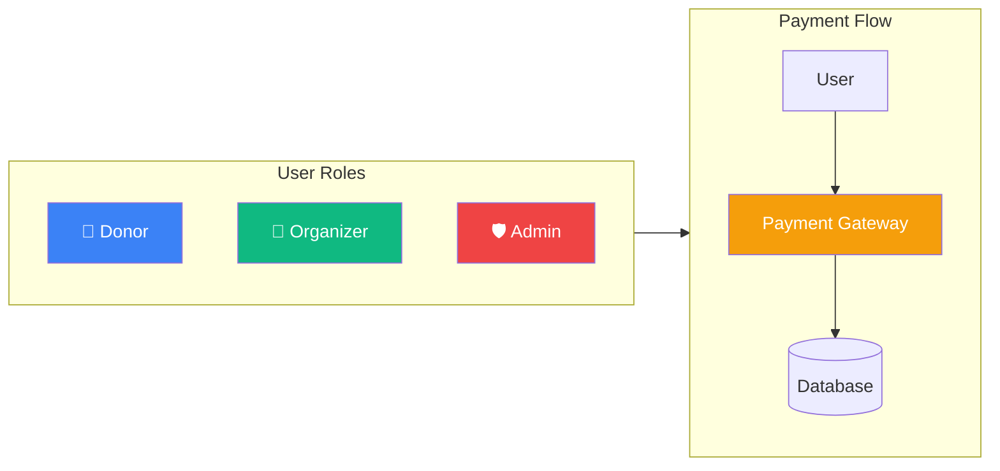
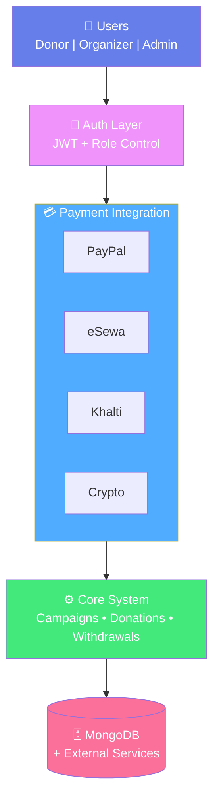

# Simplified Architecture Diagrams for A1 Poster

## Option A: Minimal 3-Layer Architecture (RECOMMENDED FOR POSTER)



---

## Option B: Focused Payment Flow Only



---

## Option C: 3-Tier Role Architecture Only



---

## Option D: Side-by-Side Mini Diagrams (BEST FOR POSTERS)

### Left Side: User Roles | Right Side: Payment Flow



---

## Option E: Single Comprehensive but Compact Diagram



---

## 💡 Poster Layout Recommendations:

### **Layout 1: Two-Column Approach**
```\n┌─────────────────┬─────────────────┐\n│   LEFT COLUMN   │  RIGHT COLUMN   │\n│                 │                 │\n│ 3-Tier Roles    │  Payment Flow   │\n│ (Option C)      │  (Option B)     │\n│                 │                 │\n└─────────────────┴─────────────────┘\n```

### **Layout 2: Top-Bottom Approach**
```\n┌─────────────────────────────┐\n│    TOP: User Roles          │\n│    (Option C - Horizontal)  │\n├─────────────────────────────┤\n│    BOTTOM: Payment Flow     │\n│    (Option B)               │\n└─────────────────────────────┘\n```

### **Layout 3: Single Focused Diagram (RECOMMENDED)**
```\n┌─────────────────────────────┐\n│                             │\n│   Option A or E             │\n│   (3-Layer Architecture)    │\n│                             │\n│   Simple & Clear            │\n│                             │\n└─────────────────────────────┘\n```

---

## 🎨 Pro Tips for Posters:

1. **Use Option A** (3-Layer) as your main architecture diagram
2. **Use Option C** (3-Tier Roles) in a separate section
3. **Use Option B** (Payment Flow) next to your "Testing" or "Features" section
4. **Keep text minimal** - let the diagram speak
5. **Use colors consistently** (Blue=Donor, Green=Organizer, Red=Admin)
6. **Export as SVG** for crisp printing at any size
7. **Add diagram title** above each visualization

---

## Quick Export Guide:

1. Go to https://mermaid.live/
2. Paste any option above
3. Click "Actions" → "Export PNG/SVG"
4. For posters: **Export as SVG** (better quality)
5. Insert into your poster HTML/PDF

**My Recommendation**: Use **Option A** for main architecture + **Option C** for roles section. This gives clarity without overwhelming detail!
